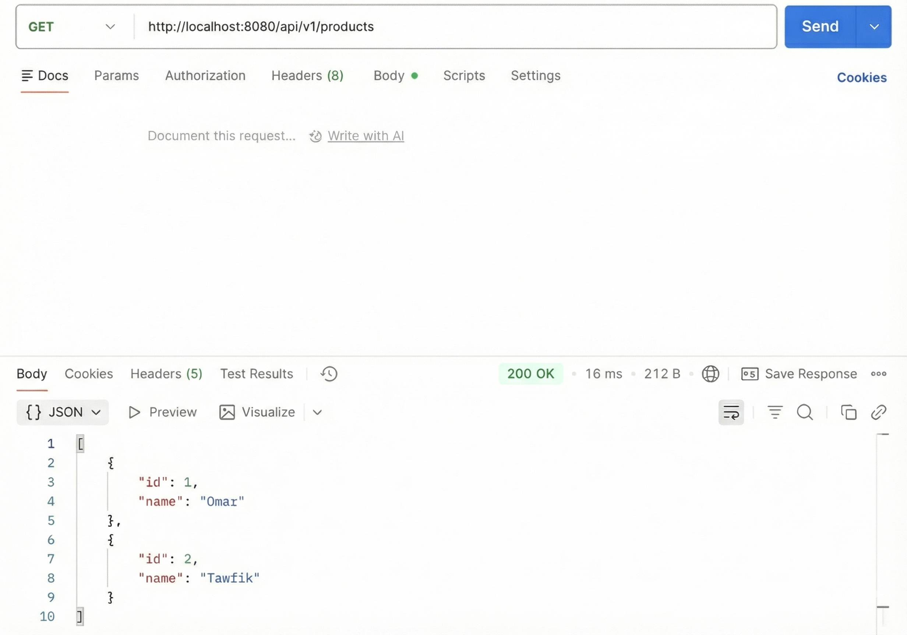
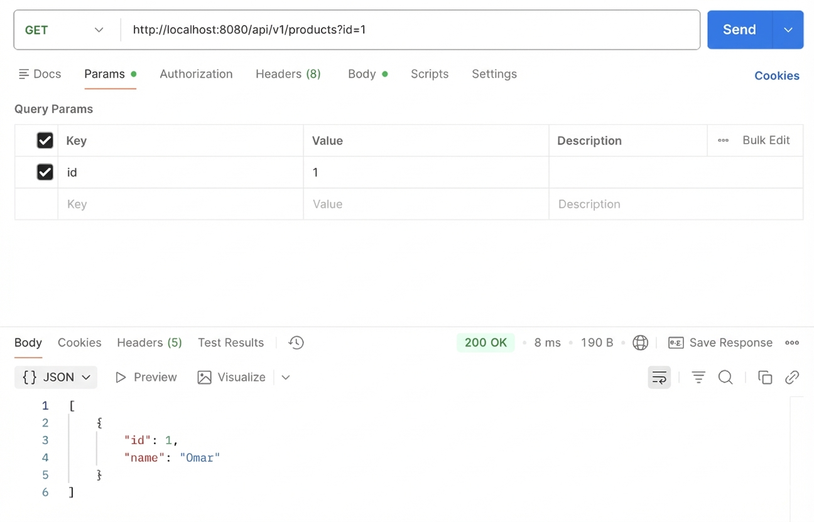
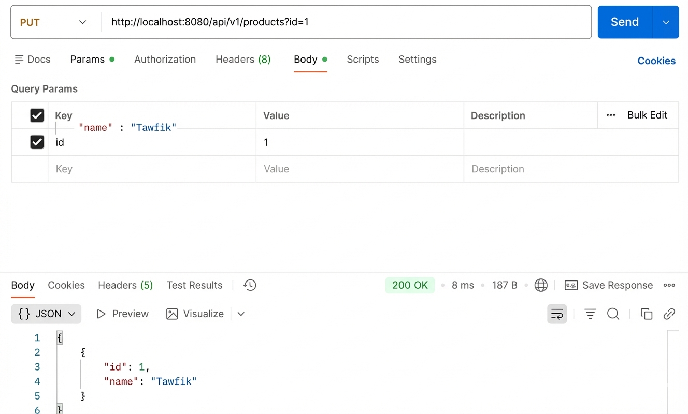
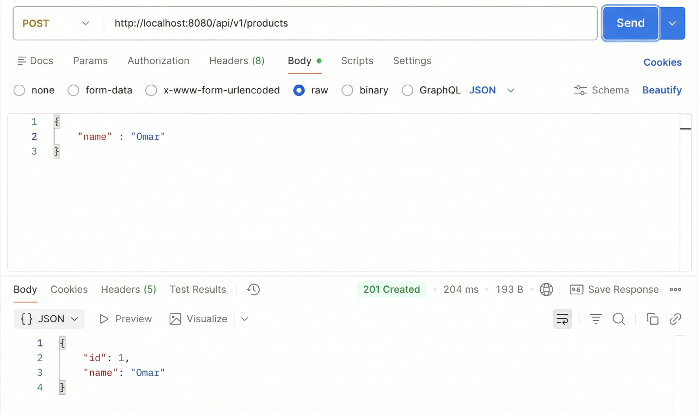

# First REST API – Task 2

## Description
This application is a REST-based backend service implemented using Spring Boot as part of Task 2 in the Spring Framework Apps course at Akademia Finansów i Biznesu Vistula. The system focuses on managing product records and exposes REST endpoints that follow standard CRUD architecture.

## Technologies
Java, Spring Boot, Spring Web, Spring Data JPA, H2 Database, Swagger (OpenAPI), Maven

## Functionality
The API allows:
- creating a product (POST)
- retrieving a product by ID (GET)
- retrieving all products (GET)
- updating a product (PUT)
- deleting a product (DELETE)



## Running the Application
1. Open the project in IntelliJ IDEA
2. Reload Maven dependencies
3. Run `FirstRestApiApplication`
4. Application runs at `http://localhost:8080`






## Swagger UI
`http://localhost:8080/swagger-ui/index.html`

## H2 Database Console
`http://localhost:8080/console`



## Example Request
```json
POST /api/v1/products
{
  "name": "pc"
}
```
## Author
`Omar Twafa`


